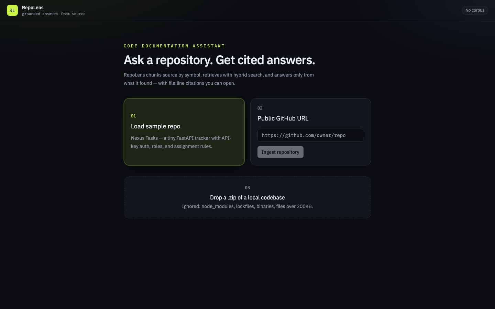
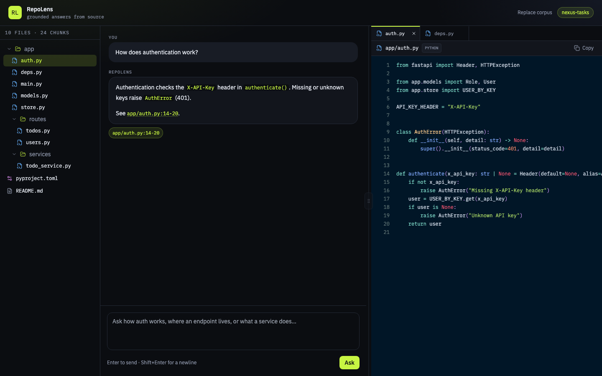

# RepoLens

A code documentation assistant. Point it at a repository, ask how the thing works, get an answer with `path:line` citations.

I built this as a take-home. The goal was a working RAG loop with boring, inspectable engineering — not an agent framework demo.

## Quick setup

You need Docker, or Python 3.12 + Node 22. An OpenAI-compatible API key is required for ingest and chat. Defaults are `gpt-4o-mini` + `text-embedding-3-small`. Groq works via `OPENAI_BASE_URL`: embeddings stay local, chat is taken from Groq's live `/models` list (currently `openai/gpt-oss-20b` — `llama-3.1-8b-instant` was shut down in Aug 2026).

```bash
cd backend
cp .env.example .env
# put a real key in OPENAI_API_KEY

docker compose up --build
# UI: http://localhost:3000
# API: http://localhost:8000/api/health
```

Without Docker:

```bash
cp .env.example .env

cd backend
python3.12 -m venv .venv
source .venv/bin/activate
pip install -r requirements.txt
uvicorn app.main:app --reload --port 8000

# another terminal
cd frontend
npm install
npm run dev
# UI: http://localhost:5173
```

Tests (no API key, LLM is faked):

```bash
cd backend && pytest -q
```

Load the bundled **Nexus Tasks** sample from the UI, then ask:

- How does authentication work?
- Where are the API endpoints defined?
- Who can reassign a task, and where is that enforced?
- What dependencies does this project have?

Public GitHub URL and ZIP upload are the other two ingest paths.

## Architecture

```
Browser  --ingest/chat-->  FastAPI
                             |-- IngestService  (ZIP / GitHub zipball / sample)
                             |-- Chunker        (AST / signature / window)
                             |-- Store          (files on disk + Chroma + BM25 corpus)
                             |-- RetrieveService (vector + BM25 + RRF)
                             |-- RagService     (prompt, SSE, citations)
                             '-- OpenAI-compatible LLM / embeddings
```

The frontend is a Vite + React SPA. Nginx (in Docker) proxies `/api` to the backend so the browser stays same-origin. Chat is SSE; I used a raw ASGI request-id middleware because Starlette's `BaseHTTPMiddleware` buffers streaming responses and would silently kill token streaming.

One corpus at a time. Re-ingest replaces it. No accounts, no jobs queue, no extra containers.

## RAG / LLM approach and decisions

**Orchestration.** I did not use LangChain or LlamaIndex. For this size they add a prompt I cannot see and a dependency I cannot debug in an interview. The pipeline is three services: ingest, retrieve, generate. If that becomes painful, the extraction boundary is obvious.

**Chunking.** Default 512-token windows are the wrong default for code. A function is the unit a human asks about.

- Python: `ast` — top-level functions/classes, plus methods as their own chunks (overlap is fine; retrieval is not a partition).
- JS/TS/Go/Rust: regex on signatures. Tree-sitter would be better; it is also a native binary in a take-home Docker image.
- Everything else (README, pyproject, yaml): line windows, overlap 15, never crossing file boundaries.
- Ignore list: `.git`, `node_modules`, lockfiles, binaries, files > 200KB. Caps: 400 files, 4000 chunks, 20MB zip.

**Embeddings.** Default is `text-embedding-3-small` on OpenAI/OpenRouter. Groq's `/embeddings` 404s (`nomic-embed-text-v1_5` included), so on a Groq base URL I embed locally with the hashing trick and let BM25 carry identifier search. That is a trade-off, not a hidden OpenAI call. A code-specialized remote embedding is the first upgrade if quality is the bottleneck.

**LLM.** `gpt-4o-mini`, temperature 0.1. I do not need GPT-4.1 to quote `authenticate()`. The client is base-URL-swappable so the same code talks to OpenAI, Groq, or Ollama.

**Vector store.** Chroma, persistent on disk, cosine HNSW. I considered Qdrant and pgvector. Qdrant is the right production shape; it is the wrong number of containers for a demo. pgvector is what I would actually ship (one database, backups, IAM). Chroma is the local stand-in.

**Retrieval.** Hybrid, always.

1. Embed the question, Chroma top-12.
2. BM25 top-12 over `path + symbol + text`, tokenized with snake/camel splits. Identifier search is not optional for code — `get_user_by_id` and `fetch_account` are semantic neighbors and lexical strangers.
3. Reciprocal Rank Fusion (k=60), keep 6.
4. Hard cap on context characters. Rank is not a license to dump the repo into the prompt.

No cross-encoder rerank. It would help. It also doubles latency and adds a model. Next.

**Prompt and context.** System prompt: answer only from `<excerpt>` blocks, cite `[path:start-end]`, refuse if the excerpts do not support the claim. Retrieved code is wrapped as data, not instructions — basic prompt-injection hygiene, not a security product. Chat history is the last 8 turns; previous retrievals are not replayed (they rot and waste tokens).

**Guardrails.** Extension allowlist. Size/file caps. Zip path traversal check. Empty retrieval does not call the LLM — it returns a refusal event. The model is not given a tool to execute code. This is not auth. Anyone who can hit the API can ingest.

**Quality.** I did not build an eval harness. I did write pytest around the parts that actually fail: AST chunk boundaries, ignore filters, RRF, empty-retrieval refusal, citations copied from chunk metadata, ingest+chat with a fake LLM. Manual questions against the sample repo are in this README. If I had another week, the next test is a 20-question golden set with retrieval-hit-rate, not BLEU.

**Observability.** JSON logs to stdout. `X-Request-ID` on every request. Ingest logs file/chunk/skip counts. RAG logs duration, top paths, top RRF score. `/api/health` and `/api/ready`. No LangSmith. The structured fields are what I would export to Cloud Logging / Datadog.

## What production would require

This is a single-node toy. To put it on a hyperscaler without lying:

**Compute.** API as Cloud Run / ECS Fargate / Azure Container Apps. Ingest is CPU- and memory-heavy (unzip, embed batches) — run it on a worker (Cloud Tasks + a second service, or SQS + a consumer), not on the request that the UI is waiting on. Cap concurrency. Stream chat through an HTTP service that does not buffer (watch Nginx `proxy_buffering off`, ALB idle timeouts, Cloud Run request timeout).

**Storage.** Source files in S3 / GCS / Azure Blob, not a local volume. Manifest + chunks as Postgres rows. Vector index: pgvector on the same Postgres, or Qdrant Cloud / Pinecone if the corpus is multi-tenant and huge. Chroma does not belong in prod.

**Identity.** This API is open. Production: SSO (Cognito / IAM Identity Center / Entra), per-workspace isolation, signed upload URLs, no public GitHub-only assumption. Private repos need a GitHub App, not a zipball scrape.

**Scale.** Embeddings and LLM calls dominate cost, not FastAPI. Batch embeddings, cache them by content hash, set max tokens, rate-limit per tenant. Horizontal scale the API; keep one writer per corpus during ingest (a lock, not hope).

**Quality loop.** Offline eval set, retrieval recall@k, an "I don't know" rate, traces in Langfuse or OpenTelemetry with the retrieved chunk ids. Prompt and chunker are versioned. You cannot A/B what you cannot name.

**Ops.** One container image per service, IaC (Terraform/CDK), secrets in a manager not `.env`, WAF in front, backup the vector+object stores, a dead-letter queue for failed ingests.

I would start on **GCP Cloud Run + Cloud SQL pgvector + GCS** or **AWS ECS + RDS + S3**. Cloudflare is a fine CDN/WAF for the SPA; I would not put the embedding path on Workers without a good reason.

## Key technical decisions

- **Hand-rolled RAG.** I want the prompt, the k, and the fusion in this repo. Frameworks are allowed when they earn it.
- **Hybrid retrieval on day one.** For code, BM25 is not a nice-to-have.
- **AST chunking for Python only.** Highest signal, zero native deps. Heuristics elsewhere. Documented, not pretended.
- **OpenAI-compatible client.** One interface, four vendors.
- **Chroma locally, pgvector in the README.** Matching the demo infra to the essay is how take-homes get over-engineered.
- **SSE, not websockets.** One question, one stream, HTTP/1.1 friendly.
- **Single-tenant replace-on-ingest.** Multi-corpus would have doubled the data model for a feature nobody asked to demo.

## Engineering standards I followed (and skipped)

Followed: typed Python 3.11+, Pydantic settings, thin routers, logic in services, fail-fast ingest errors, zip path-traversal checks, pytest on the pipeline not the prompt, Docker Compose, structured logs, no `except Exception: pass`.

Skipped on purpose: auth, mypy in CI, 90% coverage, Kubernetes, Celery, a design system, frontend E2E, tree-sitter, rerankers. Time-boxed. The skip list is the backlog, not an accident.

## How I used AI tools

I used Cursor to move faster. I did not let it pick the product or the RAG shape.

**Do.** I wrote the plan first (chunking strategy, hybrid retrieval, no LangChain, SSE citations). I used the assistant to scaffold files, dump boilerplate, and generate the first cut of tests. I ran pytest and fixed the code, not the tests.

**Don't.** I do not accept generated READMEs, generated prompts, or generated architecture essays. Those are the things this assignment is grading. I also do not paste a LangChain tutorial into a take-home and call it a design. If I cannot explain a chunker in an interview, it does not ship.

**Repeatable.** Constraints live in `app/consts.py`, not in chat history. The fake LLM in tests is the seam I would keep if an intern picked up the repo. I review anything that touches retrieval, prompts, or ingest limits as if a junior wrote it — because the model did.

## What I would do with more time

- Tree-sitter chunking for TS/Go, plus a "file overview" chunk for each path.
- Cross-encoder rerank on the fused 12.
- A 20-question eval set with recall@6 and citation precision.
- Private GitHub via a token, incremental ingest (hash files, embed only diffs).
- pgvector + a real user/workspace model.
- Streaming token counts in the UI, and a "why this chunk" debug drawer behind a flag.

## Known edges I did not chase

- Private GitHub repos (no token flow).
- Generated/minified files that sneak past the ignore list.
- Very large functions still become windows; quality drops.
- Re-ingest during an in-flight chat.
- Unicode-unfriendly encodings besides "replace".
- Multi-user concurrent ingest (last write wins).

## Screenshots




